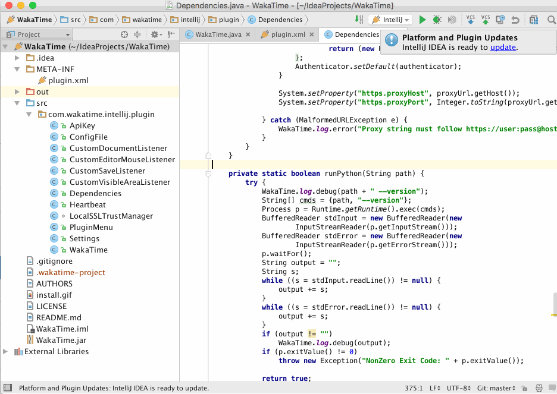

consulo-wakatime
==================

Metrics, insights, and time tracking automatically generated from your programming activity.

Installation
------------

1. Inside your IDE, select `Preferences` -> `Plugins` -> `Browse Repositories...`.

2. Search for `WakaTime`.

3. Click the green `Install Plugin` button.

4. Click `Close` and `OK`, then Re-launch your IDE.

5. Enter your [api key](https://wakatime.com/settings#apikey) in `Tools -> WakaTime API Key`, then click `Save`.

6. Use your IDE and your coding activity will be displayed on your [WakaTime dashboard](https://wakatime.com).

Screen Shots
------------

Configuring
-----------

WakaTime for Jetbrains IDE's can be configured via Tools -> WakaTime Settings.

For more settings, WakaTime plugins share a common config file `.wakatime.cfg` located in your user home directory with [these options](https://github.com/wakatime/wakatime#configuring) available.

Uninstalling
------------

Inside your IDE, select `Preferences` -> `Plugins`, then find the `WakaTime` plugin. Click `Uninstall`. Then delete your `~/.wakatime.cfg` config file.

Troubleshooting
---------------

First, turn on debug mode from File -> WakaTime Settings. Then restart your IDE.

Now, look for WakaTime related messages in your `idea.log` file:

`Help` -> `Show Log` ( [Locating your idea.log file](https://intellij-support.jetbrains.com/hc/en-us/articles/207241085-Locating-IDE-log-files) )

If the plugin was not loaded, you won't have a WakaTime Settings menu.
In that case, add this line to your `~/.wakatime.cfg` file:

    debug = true

(`C:\Users\<user>\.wakatime.cfg` on Windows)

For more general troubleshooting information, see [wakatime/wakatime#troubleshooting](https://github.com/wakatime/wakatime#troubleshooting).
